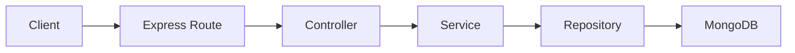

# Customer Data Profiling Backend

A production-oriented Express + TypeScript backend for real estate lead ingestion, customer profiling, duplicate handling, retrieval, and lightweight analytics.

The project is intentionally scoped as a maintainable MERN backend project rather than a full CRM platform. It demonstrates clean architecture, runtime validation, MongoDB persistence, observability, API documentation, testing, Docker, and CI.

## Features

- Import lead inquiries with `POST /analyze`
- Normalize phone numbers, emails, budgets, locations, lead types, and dates
- Merge duplicate customers by normalized phone number
- Preserve full inquiry history per customer profile
- Retrieve customer profile details with `GET /lead/:phone`
- Generate summary analytics with `GET /leadSummary`
- Swagger UI at `/docs`
- Deterministic sample import with `npm run seed`

## Tech Stack

- Node.js, Express.js, TypeScript
- MongoDB, Mongoose
- Zod, Pino
- Swagger/OpenAPI
- Vitest, ESLint, Prettier
- Docker, GitHub Actions

## Quick Start

```bash
npm install
cp .env.example .env
docker compose up -d mongo
npm run seed
npm run dev
```

Open Swagger at `http://localhost:3000/docs`.

## Scripts

| Command             | Purpose                                 |
| ------------------- | --------------------------------------- |
| `npm run dev`       | Run the API in TypeScript watch mode    |
| `npm run build`     | Compile TypeScript                      |
| `npm start`         | Run the compiled server                 |
| `npm run seed`      | Reset and import project sample data |
| `npm run lint`      | Run ESLint                              |
| `npm run format`    | Check Prettier formatting               |
| `npm run typecheck` | Run TypeScript checks without emit      |
| `npm test`          | Run Vitest tests                        |

## Environment

| Variable          | Default                                             | Purpose                                         |
| ----------------- | --------------------------------------------------- | ----------------------------------------------- |
| `NODE_ENV`        | `development`                                       | Runtime environment                             |
| `PORT`            | `3000`                                              | HTTP server port                                |
| `MONGO_URI`       | `mongodb://localhost:27017/customer-data-profiling` | MongoDB connection string                       |
| `LOG_LEVEL`       | environment-aware                                   | Pino log level                                  |
| `API_PREFIX`      | `/api/v1`                                           | Reserved API prefix for future versioned routes |
| `SWAGGER_ENABLED` | `true`                                              | Enables Swagger UI                              |

## API

| Method | Path           | Purpose                                                    |
| ------ | -------------- | ---------------------------------------------------------- |
| `GET`  | `/health`      | Health and database readiness                              |
| `POST` | `/analyze`     | Validate, normalize, merge, and persist lead inquiries     |
| `GET`  | `/lead/:phone` | Retrieve a normalized customer profile and inquiry history |
| `GET`  | `/leadSummary` | Return CRM-style summary analytics                         |

All API responses use a consistent shape:

```json
{ "success": true, "message": "Operation completed", "data": {} }
```

```json
{ "success": false, "message": "Validation failed", "errors": [] }
```

## Architecture



Controllers stay HTTP-focused. Services own business rules, normalization, duplicate handling, and analytics orchestration. Repositories isolate MongoDB access. Validators protect runtime boundaries with Zod.

More detail:

- [Architecture](docs/architecture.md)
- [API Design](docs/api-design.md)
- [Analytics](docs/analytics.md)
- [Normalization](docs/normalization.md)
- [Tradeoffs](docs/tradeoffs.md)

## Seed Workflow

```bash
docker compose up -d mongo
npm run seed
```

The seed script reads `docs/data/sample_lead_data.json`, validates through the same Zod schema as `POST /analyze`, clears existing lead profiles, and ingests through the real service layer. Clearing first keeps reviewer runs deterministic.

## Docker

```bash
docker compose up --build
```

For local development with only MongoDB:

```bash
docker compose up -d mongo
```

## CI

GitHub Actions runs:

- lint
- format check
- typecheck
- tests
- build

## Assumptions

- Phone number is the primary unique customer identifier.
- `property_type` represents lead type: `sale` or `rental`.
- `preferred_property_type` represents the physical property category.
- Analytics are service-level calculations over normalized profiles for readability; Mongo aggregation can replace this behind the repository boundary as data grows.
