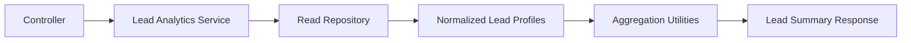

# Analytics

Analytics are intentionally separated from controllers and repositories.

## Current Metrics

`GET /leadSummary` returns:

- total customers
- total inquiries
- sale vs rental distribution
- average budget by lead type
- monthly inquiry trends
- unique location count
- most common locations

## Tradeoff

The current implementation loads normalized profiles through the repository and calculates analytics in service utilities. This is deliberate for the project dataset: the logic is readable, deterministic, and easy to unit test.

For larger datasets, the same repository boundary can move calculations into MongoDB aggregation pipelines while preserving the API response contract.
