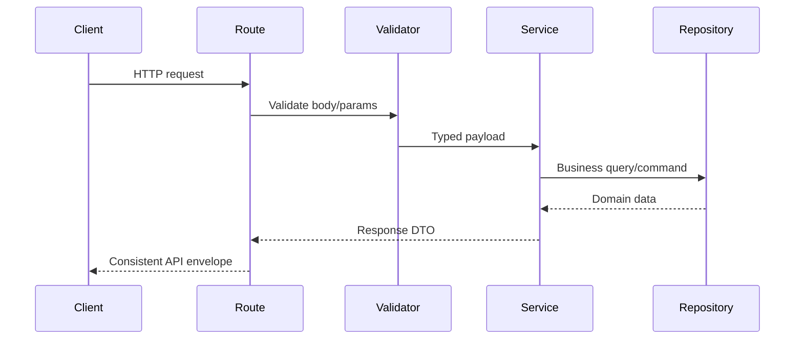

# API Design

The API uses consistent response envelopes:

```json
{ "success": true, "message": "Lead profile retrieved", "data": {} }
```

```json
{ "success": false, "message": "Invalid request body", "errors": [] }
```

## Endpoints

| Method | Path           | Purpose                                |
| ------ | -------------- | -------------------------------------- |
| `GET`  | `/health`      | Process and database health            |
| `POST` | `/analyze`     | Ingest and profile lead inquiries      |
| `GET`  | `/lead/:phone` | Retrieve a normalized customer profile |
| `GET`  | `/leadSummary` | Retrieve aggregate lead analytics      |

## Request Flow



Swagger at `/docs` is the primary interactive API reference. It includes request examples and validation error responses for reviewer testing.
