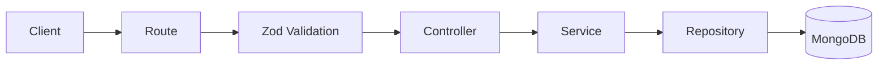

# Architecture

The backend uses a layered modular structure:

```text
Route -> Controller -> Service -> Repository -> Database
```



## Boundaries

- Routes compose middleware and controllers.
- Controllers translate HTTP requests into service calls and return API responses.
- Services own business decisions such as normalization, duplicate merging, profile shaping, and analytics orchestration.
- Repositories isolate MongoDB and Mongoose access.
- Shared utilities provide cross-cutting concerns such as logging, config, validation helpers, and response helpers.

This keeps feature work localized. A future developer can replace repository internals or move analytics into MongoDB aggregation without changing route/controller contracts.

## Module Layout

The lead module is feature-oriented:

```text
src/modules/lead/
  analytics/
  controllers/
  repositories/
  routes/
  schemas/
  services/
  types/
  validators/
```

The shared layer holds reusable infrastructure that should not know about lead-specific business rules.
