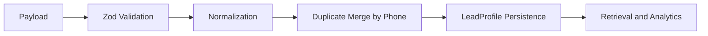

# Normalization

Normalization happens before persistence and outside controllers.

## Rules

- Phone numbers are stored as `+<digits>`.
- Emails are trimmed and lowercased.
- Locations are trimmed, whitespace-normalized, and title-cased.
- Budgets accept numbers or formatted strings and are stored as positive numbers.
- Dates must parse safely before persistence.
- Lead type is normalized to `sale` or `rental`.

## Duplicate Handling

Phone number is the deterministic customer identity. If an incoming inquiry matches an existing normalized phone number, the service appends the inquiry to `inquiryHistory` and refreshes profile metadata. It does not create another customer document.

This structure supports profile retrieval and analytics without fragmenting a customer across many records.
